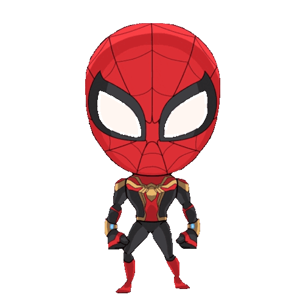

<div align="center">

# 🕸️ THE MULTIVERSE IN A BOX
### (A high-stakes portfolio from Earth-1610)



---

### "Anyone can wear the mask... but it takes a special kind of hero to center a <div> on the first try." 🕷️

A portfolio that glitches harder than Miles in a collider. 
Built with 10% skill, 20% concentrated power of will, and 70% pure caffeine. 

---

## 🎭 THE DIMENSIONAL DEETS

**Glitching on Purpose**<br/>
If the screen splits into Cyan and Magenta, don't call tech support. It's called "Aesthetic." 
My laptop might be screaming, but the UI is *vibing*.

<br/>

**Spider-Sense UI**<br/>
Highly interactive elements that react faster than a Spidey-sense in a hallway fight.
Click the logo three times if you’re brave enough to trigger a total reality collapse.

<br/>

**The Ben-Day Treatment**<br/>
I pumped so many halftone dots into this project that your monitor might actually 
start smelling like a vintage comic book shop.

---

## 🎒 THE GEAR

**The Science Side:**<br/>
Next.js (The Web) • Framer Motion (The Swing) • Tailwind (The Suit)

<br/>

**The Real Talk:**<br/>
Excessive Caffeine • Midnight Debugging • Sheer Multiversal Will

---

## 🚀 COLLIDER SETUP

</div>

```bash
# Clone the dimension
git clone https://github.com/Chaitanyahoon/spidermon.git

# Feed the spiders
npm install

# Open the Multiverse
npm run dev
```

<div align="center">

---

### 🕸️ Swing by and say hi!
[LinkedIn](https://linkedin.com/in/chaitanyapatil700) • [GitHub](https://github.com/Chaitanyahoon)

---

#### *No spiders were harmed in the making of this website.*
*(Except the one in the corner of my room. He knows what he did.)*

</div>
