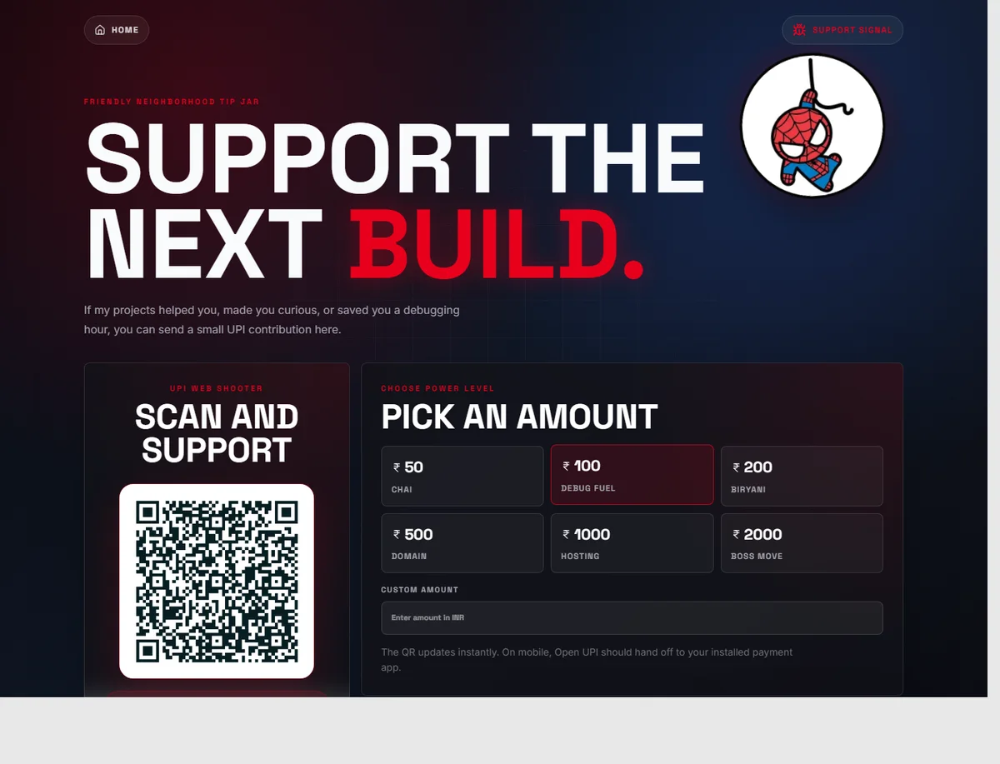

# Chaitanya Patil Portfolio

Spider-Man inspired portfolio for Chaitanya Patil, built with Next.js, React, Tailwind CSS, and Framer Motion.



## Overview

This site is a personal developer portfolio with an interactive hero, project pages, resume route, support page, animated overlays, custom cursor effects, and hidden easter eggs.

Live site: https://www.chaitanyapatil.online

## Features

- Interactive hero with portrait-to-Spider-Man reveal
- Project showcase with generated static project routes
- Live project preview cards with GitHub repository stats
- Currently building section for active project work
- Resume page with downloadable PDF
- UPI support page with dynamic QR generation
- SEO metadata, sitemap, robots route, Open Graph image generation
- Spider-themed UI overlays, collectible easter eggs, loading screen, and CTA pulse effects
- GitHub Actions build validation

## Tech Stack

- Next.js 16
- React 19
- TypeScript
- Tailwind CSS
- Framer Motion
- Lucide React
- QRCode

## Getting Started

```bash
npm install
npm run dev
```

Open `http://localhost:3000`.

## Scripts

```bash
npm run dev      # Start local development server
npm run build    # Create production build
npm run start    # Start production server
npm run lint     # Run ESLint
```

## Project Structure

```text
app/
  components/        Shared UI and interactive effects
  data/              Project data
  projects/[slug]/   Static project detail pages
  resume/            Resume page
  support/           UPI support page
public/
  easter-eggs/       Hidden sticker assets
  readme/            Static README preview
  Chaitanya*.webp    Optimized portfolio image assets
```

## Notes

`npm run lint` and `npm run build` are the primary validation commands.

Latest local Lighthouse check on `/support`: Performance 93, Accessibility 100, Best Practices 100, SEO 100.
